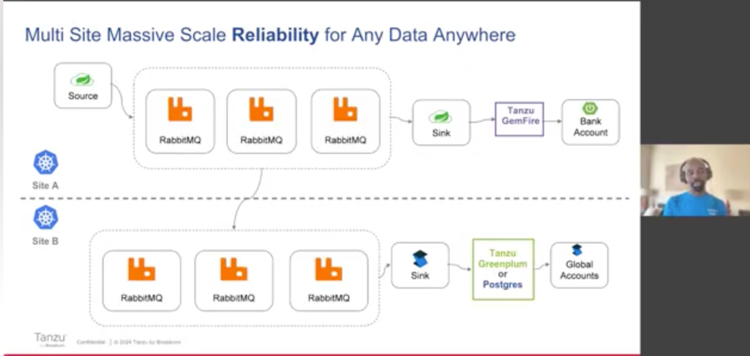
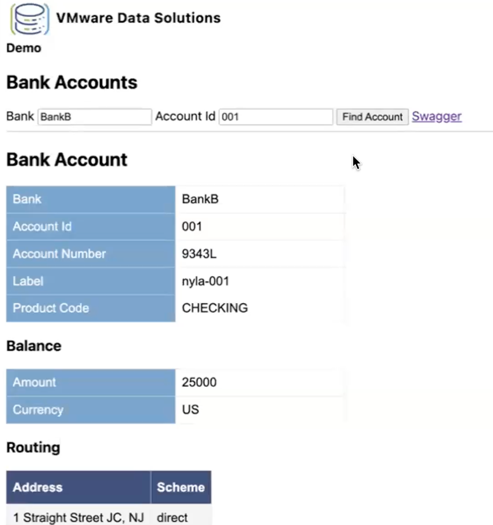
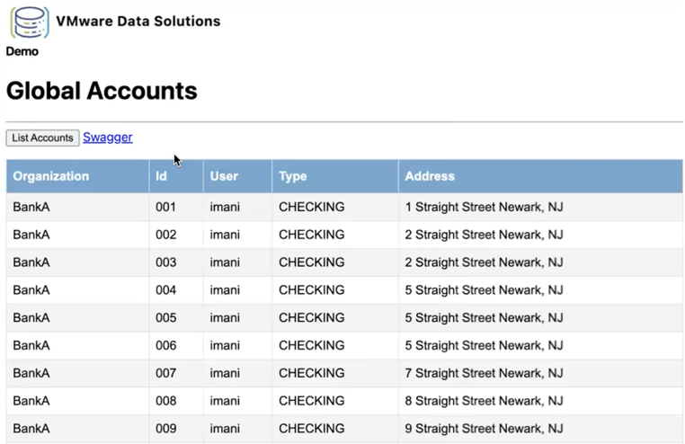

# Financial Open Banking Showcase

This project contain example cloud-native Spring and .NET SteelToe applications.
The  purpose is to demonstrate  financial sector use cases with the Tanzu portfolio of technologies such as 
[Tanzu Data Services](https://tanzu.vmware.com/data) ( [RabbitMQ](https://tanzu.vmware.com/rabbitmq), [Gemfire](https://tanzu.vmware.com/gemfire), [Tanzu Postgres](https://tanzu.vmware.com/postgres), [Tanzu Greenplum](https://tanzu.vmware.com/greenplum), [Tanzu MySQL](https://docs.vmware.com/en/VMware-Tanzu-SQL-with-MySQL-for-Kubernetes/1.2/tanzu-mysql-k8s/GUID-index.html)), [Spring](spring.io), [Spring Cloud DataFlow](https://spring.io/projects/spring-cloud-dataflow) and more. 

**Publications**

- [Banking on VMware Tanzu RabbitMQ for Robust Messaging](https://www.brighttalk.com/webcast/14883/606826)
- [Anywhere Any Data Resilience with VMware Data Services](https://tanzu.vmware.com/content/videos/anywhere-any-data-resilience-with-vmware-data-services)

Here are some useful links:

- [Open Banking Project Architecture](https://github.com/OpenBankProject/OBP-API/wiki/Open-Bank-Project-Architecture)
- [PSD2 Api Explorer](https://psd2-apiexplorer.openbankproject.com/?tags=PSD2&operation_id=OBPv3_0_0-getCoreTransactionsForBankAccount&currentTag=Transaction&bank_id=at02-0182--01&account_id=&view_id=&counterparty_id=&transaction_id=)

# Data REST Services

The following is the list of services that implement the Open Bank API 

| Service                                                                                 | Notes                               |
|-----------------------------------------------------------------------------------------|-------------------------------------|
| [atm-rest-service](applications/atm-rest-service)                                       | ATM REST API                        |
| [bank-account-rest-service](applications/bank-account-rest-service)                     | Account REST API                    |
| [bank-rest-service](applications/ba nk-rest-service)                                    | Bank REST API                       |

# Tanzu GemFire Building

This repository uses GemFire. GemFire is free to use for local development.
In order to build Please following the instruction [here are details to set up your credentials in your .m2/settings.xml file to access the dependencies in the GemFire maven repository](https://docs.vmware.com/en/VMware-GemFire/10.0/gf/getting_started-installation-obtain_gemfire_maven.html).

# Brown-Field Integration

## Database 

See the following for a Change Data Capture ([CDC](docs/k8)) example to integrate existing account information from a 
relational database (such as Postgres) 
using [RabbitMQ](https://tanzu.vmware.com/rabbitmq), a data cache [GemFire](https://tanzu.vmware.com/gemfire)
and [Spring Cloud Stream](https://spring.io/projects/spring-cloud-stream).

# Applications

See [bank-account-rest-service](applications/bank-account-rest-service)

See [Global Accounts](applications/global-accounts/applications/service.api)

