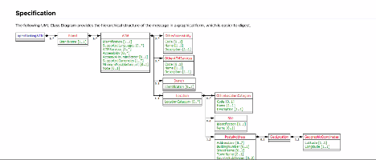

# Financial Open Banking Showcase

Example application on open banking and how the Tanzu portfolio helps. 

Here are some useful links:

- [Open Banking Project Architecture](https://github.com/OpenBankProject/OBP-API/wiki/Open-Bank-Project-Architecture)
- [PSD2 Api Explorer](https://psd2-apiexplorer.openbankproject.com/?tags=PSD2&operation_id=OBPv3_0_0-getCoreTransactionsForBankAccount&currentTag=Transaction&bank_id=at02-0182--01&account_id=&view_id=&counterparty_id=&transaction_id=)

# Data REST Services

The following is the list of services that implement the Open Bank API 

Service                                                                     |       Notes
-------------------------------------------------------------------------   |  ----------------------------
[atm-rest-service](applications/atm-rest-service)                           | ATM REST API
[bank-account-rest-service](applications/bank-account-rest-service)         | Account REST API
[bank-rest-service](applications/bank-rest-service)                         | Bank REST API

# VMware GemFire Building

This repository uses GemFire. GemFire is free to use for local development.
In order to build Please following the instruction [here to setup your credentials in your .m2/settings.xml file to access the dependencies in the GemFire maven repository](https://docs.vmware.com/en/VMware-GemFire/10.0/gf/getting_started-installation-obtain_gemfire_maven.html).

# Brown-Field Integration

## Database 

See the following for a Change Data Capture ([CDC](docs/k8)) example to integrate existing account information from a 
relational database (such as Postgres) 
using [RabbitMQ](https://tanzu.vmware.com/rabbitmq), a data cache [GemFire](https://tanzu.vmware.com/gemfire)
and [Spring Cloud Stream](https://spring.io/projects/spring-cloud-stream).

