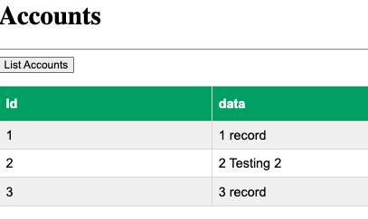

# steeltoe.data.showcase

The project is based on the [Steel Toe](https://steeltoe.io/) framework.
SteelToe is a developer API framework for [DotNet core](https://dotnet.microsoft.com/) applications. It brings microservice design patterns and lessons learned from [Spring Boot](https://spring.io/projects/spring-boot) to the Dotnet world.


Included in the showcase

- SteelToe [Postgres Connector](https://docs.steeltoe.io/api/v3/connectors/postgresql.html)
- [Repository pattern](https://learn.microsoft.com/en-us/previous-versions/msp-n-p/ff649690(v=pandp.10)?redirectedfrom=MSDN)
- SteelToe [Application Configuration](https://docs.steeltoe.io/api/v3/configuration/placeholder-provider.html)
- SteelToe [Dynamic Logging](https://docs.steeltoe.io/api/v3/logging/index.html)
- [SteelToe Stream](https://docs.steeltoe.io/api/v3/stream/)
- [RabbitMQ](https://rabbitmq.com/)
- [Postgres](https://www.postgresql.org/)
- [Database migrations](https://learn.microsoft.com/en-us/ef/core/managing-schemas/migrations/applying?tabs=dotnet-core-cli)
- Domain-driven design
- Web API Controller
- Test Driven Development using [MSTest](https://learn.microsoft.com/en-us/dotnet/core/testing/unit-testing-with-mstest)
- Mocking using [Moq](https://github.com/moq/moq)
- Mono Repo


# Running Applications


Set connection string environment environment

```shell
export ConnectionString="Host=127.0.0.1;Database=postgres;Username=postgres;Password=$POSTGRES_DB_PASSWORD"
```

## Consumer Streaming Application

```shell
export rabbit_vhost=streaming
```

```shell
cd applications/streaming.consumer
dotnet run
```


## Web Service API Application

```shell
cd applications/service.api
dotnet run
```


## Testing with Swagger


```shell
open http://localhost:5000/swagger/index.html
```

## List Account


```shell
open http://localhost:5000/swagger/index.html
```

Example List Results



# Set up Migration

This application creates the needed database schema on startup.


Install DB migration

```shell
dotnet tool install --global dotnet-ef --version "7.*"
```

Create a migration

```shell
dotnet ef migrations add InitialCreate
```

View migration SQL script

```shell
dotnet ef migrations script
```

# Unit Testing


```shell
dotnet  test
```


## MonoRep 

```shell
dotnet new sln
 
 dotnet sln add applications/service.api/steeltoe.data.showcase.csproj
 dotnet sln add applications/streaming.consumer/steeltoe.streaming.consumer.csproj
 account.service.csproj
```

Make components

```shell
mkdir -p  components/account.domain
cd components/account.domain
dotnet new classlib -f net6.0
cd ../..
```


```shell
 dotnet sln add  components/account.domain/account.domain.csproj
 dotnet sln add  components/account.service/account.service.csproj
```
